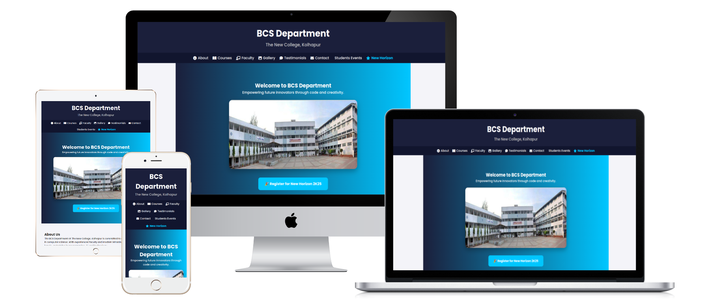

# 🌐 B.Sc. Computer Science(Entire) Website - The New College, Kolhapur

Welcome to the academic website project for the **B.Sc. Computer Science Department** of **The New College, Kolhapur**. This site is built to showcase departmental details, faculty, courses, student activities, gallery, contact info, and a special events section for the state-level competition **"New Horizon"**.

---

## 📌 Project Overview

This website acts as a central hub for:

- Department updates and information
- Course structures and syllabus
- Faculty member profiles
- Event highlights and galleries
- Testimonials from alumni and students
- Contact forms for queries and feedback
- A dedicated page for the annual **New Horizon Competition**

---

## ✨ Key Features

- ✅ Fully responsive across all devices (Mobile, Tablet, Laptop, Desktop)
- 🌙 Light/Dark theme toggle
- 🧑‍🏫 Faculty details with images and bios
- 📷 Photo gallery for events and achievements
- 📝 Testimonials section
- 📨 Contact form for Student
- 🏆 New Horizon competition info page
- 🧠 Clean UI with smooth transitions and animations

---

## 🏗️ Tech Stack

- HTML5
- CSS3 (with Flexbox/Grid and Media Queries)
- JavaScript (for interactivity and theme toggling)
- Optional: Bootstrap or Tailwind CSS for fast styling

---

## 🗂️ Folder Structure

bsc-cs-website/ │ ├── index.html               # Main homepage ├── about.html               # About the department ├── courses.html             # Courses offered ├── faculty.html             # Faculty profiles ├── gallery.html             # Photo gallery ├── testimonials.html        # Testimonials page ├── contact.html             # Contact form ├── new-horizon.html         # State-level competition page │ ├── css/ │   └── style.css            # Custom styles │ ├── js/ │   └── script.js            # Theme toggle, interactivity │ ├── images/ │   └── ...                  # All image assets │ └── README.md                # Project documentation

---

# 📸 Project Images:



---

## 🖥️ Live Demo

[](https://harshadteli.github.io/nckbcs3/)

---


## 📬feedback Form 


[](https://harshadteli.github.io/Feedback-Form-HarshTech/)

---


## 🔧 Setup Instructions

1. Clone this repository:
   ```bash
   git clone https://github.com/harshadteli/nckbcs3.git
2. Open the folder:

cd nckbcs


3. Open index.html in your browser or use a live server extension in VS Code.

---


# 💬 Feedback and Contributions

We welcome suggestions, improvements, or contributions. Please feel free to fork this repo, raise issues, or submit pull requests.


---

# 📧 Contact

Department of B.Sc. Computer Science(Entire)
The New College, Kolhapur
📍 Maharashtra, India
📩 Email us


---

🚀 Developed By

- Harshad Teli<br>
- Web & AI Tools Development | Department Projects | Digital Solutions

> "Code with purpose. Design with passion."

---